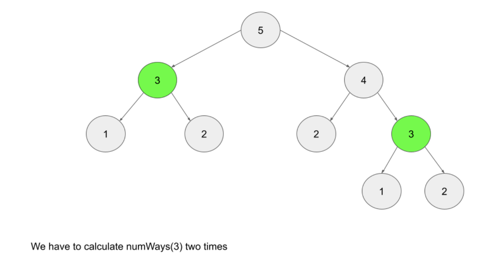

### 문제 - Paint fences

- `n`개의 posts가 있을 때 각 post에 대하여 서로 다른  `k`개의 색을 칠할 수 있다. 다만 3개의 연속적인 posts에 대하여 동일한 색을 칠할 수 없다.

### 문제의 유형 -  DP

- Reason 1) The number of ways를 묻는다
- Reason 2) 현재 내리려는 결정이 previously maed decision의 영향을 받는다.

### DP를 이루는 세 가지 구성요소

- 1. The function or array that represents the result of current state
- 2) recurrence relation - state간의 전환, 이것을 찾는 것이 문제의 핵심이다.
- 3) base case - `totalways(1)`, `totalways(2)`

### Recurrence relation of this problems - `totalways(i)`

- 이전 post와 다른 색상을 사용하려는 경우
  - `k - 1`개의 색상을 사용할 수 있으므로 `totalways(i - 1) * (k - 1)` 이다. <u><체크></u>
- 이전 post와 같은 색상을 사용하려는 경우
  - 이전과 동일한색상, 즉 오직 한 가지의 색상을 칠하는 방법만이 있다. `1 * totalways(i - 1)` 이다. 다만 한 가지 제한사항이 있다.
    - `i - 1`th post가 `i - 2`th post와 다른 색상이어야 한다. 앞서 말한 결과에 따라(<u><체크></u>)
  - `1 * totalways(i - 2) * (k - 1)` 이 도출된다.
- 따라서, `totalways(i)` = `(k - 1) * (totalways(i - 1) + totalways(i - 2))`

### Top down approach - recursion + memoization

- top down 방식은 base case를 마지막에 다룬다. recursion과 memoization으로 구현된다.
- memoization은 중복된 계산을 피하기 위해 결과값을 저장하는 방식을 말한다. 이를 위해 hashMap 또는 Array를 이용한다.
- In Python, the [functools](https://docs.python.org/3/library/functools.html) module contains functions that can be used to automatically memoize a function.
- base case와 recurrence relation을 위에서 구했기 때문에 이제 코드로 구현하면 된다.

~~~python
class Solution:
    def numWays(self, n: int, k: int) -> int:
        memo = {}
        memo[1], memo[2] = k, k * k
    
        def totalWays(i):
            if i in memo:
                return memo[i]
            
            memo[i] = (k - 1) * (totalWays(i - 1) + totalWays(i - 2))
            return memo[i]
        
        totalWays(n)
        return memo[n]
~~~

- Time complexity, Space complexity: O(n), n부터 3까지 진행하며 함수를 호출한다.

### Bottom up approch

- Tabulation이라고도 불린다.
- 일반적으로  bottom up 방식이 더욱 우수한 것으로 알려져있다.
  - Bottom-up algorithms are generally considered superior to top-down algorithms. Typically, a top-down implementation will use more space and take longer than the equivalent bottom-up approach.

- function을 사용하는 대신 3부터 n까지 array내에서 iteration이 이루어진다.

~~~python
class Solution:
    def numWays(self, n: int, k: int) -> int:
        # n이 2 이하인 경우
        if n == 1:
            return k
        if n == 2:
            return k * k

        totalWays = [0] * (n + 1)
        totalWays[1] = k
        totalWays[2] = k * k
        
        for i in range(3, n + 1):
            totalWays[i] = (k - 1) * (totalWays[i - 1] + totalWays[i - 2])
        return totalWays[n]
~~~

### bottom up with constant space

- 실질적으로 `i` 번째 단계를 계산하기 위해서 `i - 1` 와 `i - 2` 번째 단계를 위한 변수만이 필요하기 때문에 `i`를 구하기 위해 오직 두 개의 변수(`first`, `second`)만으로 문제를 해결할 수 있다.

~~~python
class Solution:
    def numWays(self, n: int, k: int) -> int:
        first, second = k, k * k

        if n == 1:
            return first
        elif n == 2:
            return second
        
        for i in range(3, n + 1):
            current = (k - 1) * (second + first)
            first = second
            second = current
        return second
~~~

- Time complexity: 3부터 n까지  iteration한다.
- Space complexity: O(1), input size와 상관없이 오직 3개의 변수만을 사용한다.