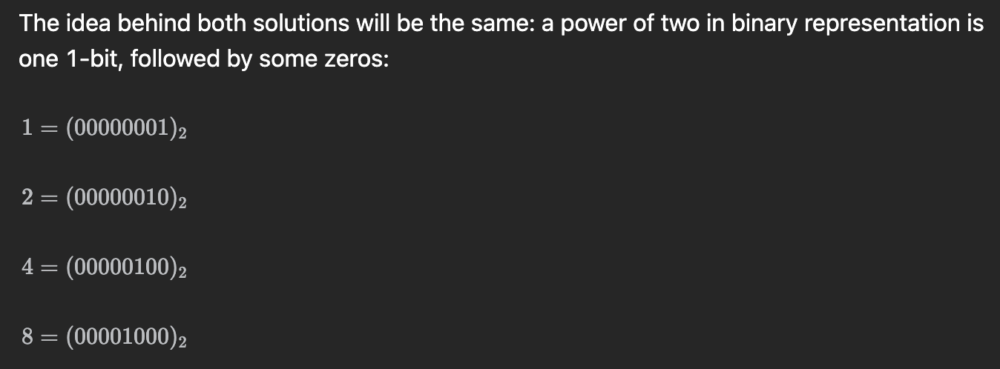
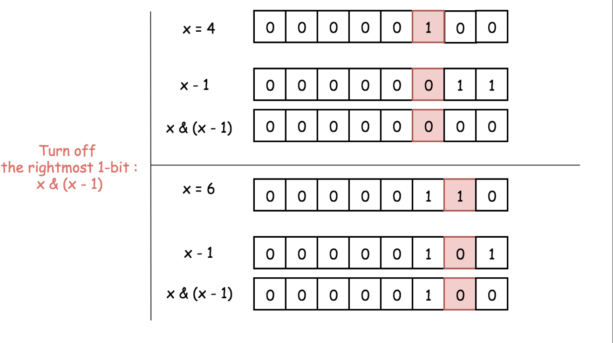
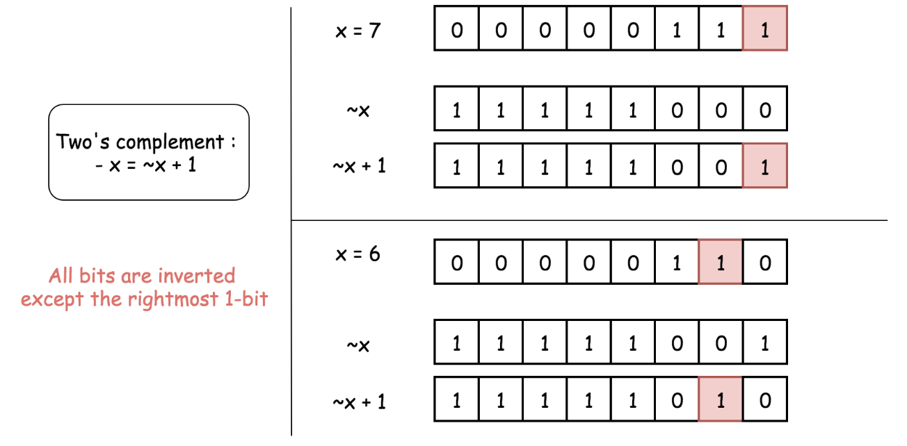
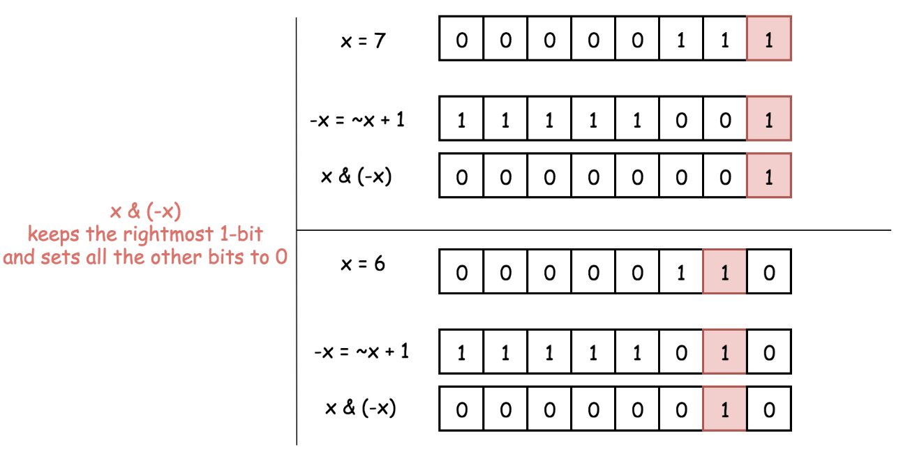
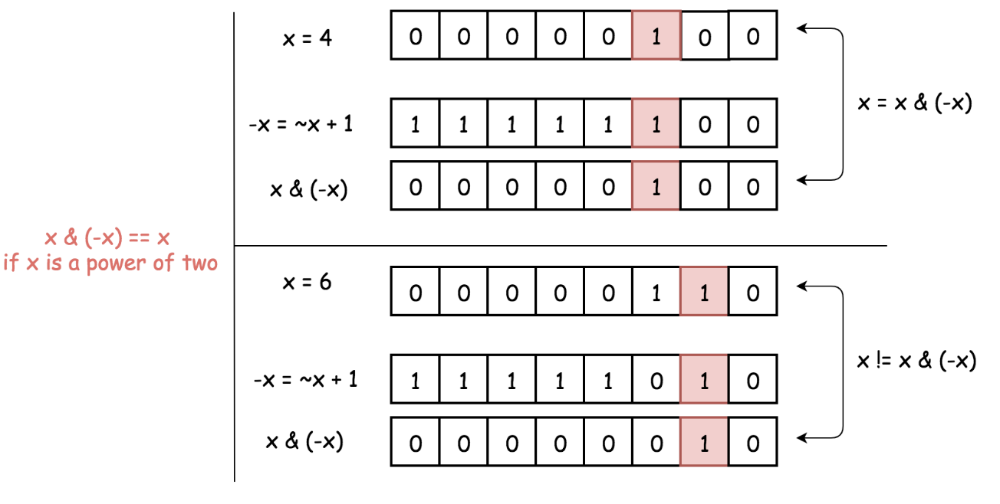

## 2.19(월) 231.  Power of Two

- 2의 거듭제곱인 integer를 binary로 표현하려면 오직 1-bit만이 필요하다.
- to compute `−x` one has to revert all bits in `x` and then add 1 to the result. for the power of two, it would result in `x` itself, since a power of two contains just one 1-bit
- 거듭제곱을 비트로 표현하였을 때의 규칙성을 배울 수 있다. 관련된 개념으로, integer 최대값 및 최소값, 그리고 오버플로우에 대해서 생각해볼 수 있다.

#### 문제

주어진 integer n에 대하여, n이 2의 거듭제곱인지 판단하라 -> bool

<u>follow-up: loop와 recursion을 사용하지 않고 판단할 수 있는가</u>

#### Intuition

- 2의 거듭제곱인 integer를 binary로 표현하려면 오직 1-bit만이 필요하다.
  - Power of two has just one 1-bit.

- `x & (x - 1)` is a way to set the rightmost 1-bit to zero.

 ~~~python
 class Solution:
     def isPowerOfTwo(self, n: int) -> bool:
         return n > 0 and n & (n - 1) == 0
 ~~~

Intuition - II

- 2의 보수(Two’s complement)

- to compute `−x` one has to revert all bits in `x` and then add 1 to the result.
- `x & (-x)` would keep that rightmost 1-bit and set all the other bits to 0.

- `-x`: for the power of two, it would result in `x` itself, since a power of two contains just one 1-bit
- Other numbers have more than 1-bit in their binary representation and hence for them `x & (-x)` would not be equal to `x` itself

~~~python
class Solution:
    def isPowerOfTwo(self, n: int) -> bool:
        return n > 0 and n & (-n) == n
~~~

#### Complexity: O(1)

> 더 알아보기
>
> 비트연산이 Time, Space O(1)인 이유?
>
> https://stackoverflow.com/questions/36830801/can-i-assume-that-a-bitwise-and-operation-is-o1-if-so-why
>
> Overflow는 왜 발생하는가?

> 컴퓨터에서의 수표현
>
> https://namu.wiki/w/%EC%BB%B4%ED%93%A8%ED%84%B0%EC%97%90%EC%84%9C%EC%9D%98%20%EC%88%98%20%ED%91%9C%ED%98%84
>
> 오버플로
>
> https://namu.wiki/w/%EC%98%A4%EB%B2%84%ED%94%8C%EB%A1%9C

## 2월 20일(화) 268. Missing number

문제

Intuition

Complexity

~~~python
~~~

## 2월 21일(수) 201.  Bitwise AND of numbers range

#### 문제

Integers `left`, `right`가 주어졌을 때, `[left, right]`에 해당하는 integers에 대하여 bitwise AND operation을 한 경우 result를 구하라

#### Intuition

`right`의 maximum value가 상당히 크므로(2^31 - 1) O(n) time 보다 효율적이어야 한다.

~~~python
~~~

#### Complexity

## 2월 21일(수) 1272. Remove Interval

#### Intuition

- 제거해야 할 부분은 기준으로, 이 부분과 겹치지 않는 부분을 `append()`한다

~~~python
# 코딩 스타일이 좋다
class Solution:
    def removeInterval(self, intervals: List[List[int]], toBeRemoved: List[int]) -> List[List[int]]:
        ans = []
        ta, tb = toBeRemoved
        for a, b in intervals:
            if (t:= min(b, ta)) > a:
                ans.append([a, t])
            if (t:= max(a, tb)) < b:
                ans.append([t, b])
        return ans
~~~

#### Complexity

- Time: `O(n)`, input array를 scan한다.
- Space: `O(1)`, Output 이외의 공간은 별도로 할당하지 않는다.

## 2월 22일(목) Find the town judge

## 2월 23일(금) Cheapest Flights Within K Steps

### 문제

Variables: `n`, `src`, `dst`, `k`, `flights`

`n`개의 cities가 주어졌을 때, `src`에서 `dst`로 `flights`를 타고 이동하려 한다. `flights` 는 `flight[i] = [from_i. to_i, price_i]`로 이루어진  Array이다. `k` steps 이내에 Most Cheapest Way로 이동한다면 얼마인가?

#### Intuition

- a) 각각의 city는 node, b) cities 간의 connection은 edge, c) cost는 weight 를 의미하는 Weighted Graph 문제이다. 통상적으로 Weighted Graph 는 Dijkstra 또는 Bellmann ford algorithm으로 해결하며 Unweighted Graph 는 BFS 로 해결한다.
  - For a weighted graph, a path having more edges does not necessarily mean the path is more expensive.

- Bellman Ford's algorithm is used to find the shortest paths from the source node to all other vertices in a weighted graph. It depends on the idea that the shortest path contains at most `N - 1` edges.

#### Bellman Ford Algorithm

1. The shortest path contains at most `N - 1` edges. because the shortest path cannot have a cycle.
2. It takes as input a directed weighted graph and a starting node
3. It produces all the shortest paths from the starting node to all other vertices.
4. It initially sets the distance from the starting node to all other vertices to infinity. The distance of the starting node is set to `0`
5. Relaxing an Edge: The algorithm loops through each edge `N - 1` times. If it finds an edge through which the distance of a node is smaller than the previously stored value, it uses this edge and stores the new value.

Restraction

- Since we are limited to `k` stops, we can modify this algorithm to restrict the maximum number of edges that can be in a path to `k + 1`.

> [Dijkstra’s algorithm](https://www.baeldung.com/cs/dijkstra) is a very famous method to find the shortest path since it requires very few resources. It works on every directed graph that doesn’t have [negative edge valuations](https://www.baeldung.com/cs/dijkstra-negative-weights).
>
> - Dijkstra’s and [Bellmann Ford’s](https://www.baeldung.com/cs/bellman-ford) algorithm use a technique called edge relaxation. This means that during traversing our graph and finding our shortest path, we update the paths we have for already known nodes as soon as we find a shorter path to reach it
> - Dijkstra’s algorithm has a time complexity of `O(V^2)` when it is implemented with a list, compared to Bellmann Ford’s algorithm with `O(VE)`, which also uses the method of relaxing edges.

## 2.27 1245 Tree Diameter

## 2.28 - 124. Binary Tree maximum path sum

### intuition

- heights를 이용하여 diameter를 구하는 방법은 즉각적으로 떠오르지만, root를 포함하지않는 경우의 max_path_sum은 떠오르지 않았다.
- dfs 를 통해 tree의 모든 노드를 거치며 diameter의 최대값을 찾는다면 그것이 max_path_sum이 될 것이다.
- `self.max_path_sum = max(self.max_path_sum, rootval + max_right_sum + max_left_sum) `
  - dfs function은 diameter를 구하기 위해 height를 반환한다.

### Fault

- 각각의 path_sum은 음수인 경우보다 0인 경우가 최대값에 해당하므로 `max_right_sum = max(max_right_sum, 0)`을 고려해주어야 한다.
- dfs function 작성시 node와 root를 섞어서 작성하였다.

## 2.28 - 128. Longest Consecutive Sequence

### 문제

- 일련의 integer numbers가 있을 때, 연속성을 유지하는 가장 긴 길이를 반환해야 한다.

- 자주 틀리는 문제이다. 더 효율적인 방법이 있지만 sort 기법을 이용해서 풀 것이다.

### Intuition

- 연속적이다: 
  1. 정렬한 후 이전 인덱스의 element와 다르다. `nums[i - 1] != nums[i]`
  2. 그리고 Substraction of two elements is One.  `nums[i] - nums[i - 1] = 1`
     1. 그렇다면 길이가 증가한다
     2. 그렇지 않다면 연속되는 sequence의 시작점이다.

### Fault

- 불필요하게 Set을 사용했다. `O(n)` Time solution에서는 필요한 DS이다.
- `nums[i - 1]`과 `nums[i] - 1`을 잘못 사용했다.
